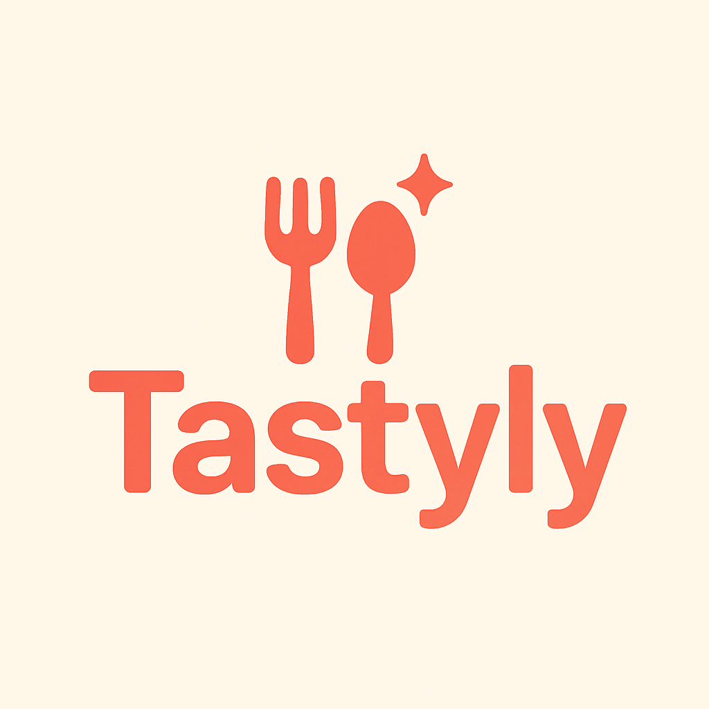

# 🍽️ Tastyly - Recipe App



Welcome to the **Tastyly App**! This is a simple, user-friendly recipe app built with **Expo** and **React Native**. Whether you're a cooking enthusiast or just looking for some inspiration, this app lets you browse, search, and save your favorite recipes. 🔥

## Features ✨

- **User Authentication**: Easily sign up, log in, and log out using **Firebase Authentication**. 🔑
- **Browse Recipes**: Discover a variety of recipes, complete with titles, descriptions, and beautiful images. 📸
- **Search Recipes**: Use the search bar to quickly find recipes based on keywords. 🔍
- **Save Favorites**: Keep track of your favorite recipes by saving them to your profile. 💾
- **Firebase Integration**: All recipe data and user preferences are stored securely in **Firebase Firestore**. 🔒

## Tech Stack 🛠️

- **Frontend**: React Native, Expo
- **Backend**: Firebase (Authentication, Firestore)
- **State Management**: React Context API or Redux (to be decided) 📚
- **Navigation**: React Navigation 🧭

## Getting Started 🚀

### Prerequisites 📝

Before you start, make sure you have the following installed:

- [Node.js](https://nodejs.org/) 🌐
- [Expo CLI](https://docs.expo.dev/get-started/installation/) 🧑‍💻
- A **Firebase** account 💻

### Installation 🏗️

1. Clone the repository:

   ```bash
   git clone https://github.com/yourusername/recipe-app.git
   ```

2. Navigate to the project folder:

   ```bash
   cd recipe-app
   ```

3. Install the dependencies:

   ```bash
   npm install
   ```

4. Set up Firebase:

   - Create a project in the [Firebase Console](https://console.firebase.google.com/). 🔥
   - Enable **Firebase Authentication** and **Firestore**. 📊
   - Copy the Firebase config object and add it to `firebaseConfig.js` in your project. 🔐

5. Run the app:

   ```bash
   expo start
   ```

Now you're all set! Open the app and start exploring the world of recipes. 🍳

## Contributing 🤝

We welcome contributions! Feel free to fork the repository and submit pull requests. Whether it's a new feature, bug fix, or improvement—your input is always appreciated. Let's make this app better together! 💪
